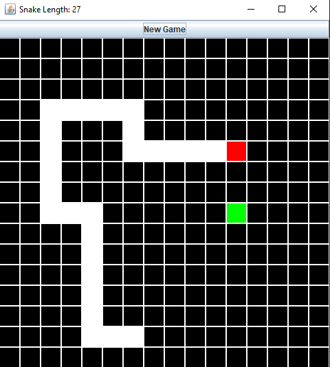

# java-snake-challenge

**Time taken:** 3hrs 22mins

**To play:**
* Compile the Java package using $`javac snake_package/*.java`
* Then run the game using $`java snake_package.SnakeGame`

**Game setup:**
* Choose playing grid size (**N x N** playing field) and game tick (milliseconds between each game tick)
    * Provide arguments when running the game $`java snake_package.SnakeGame <grid_size> <game_tick>`
    * If no arguments are provided, the game uses default values (Grid: 16x16, Tick: 150ms)